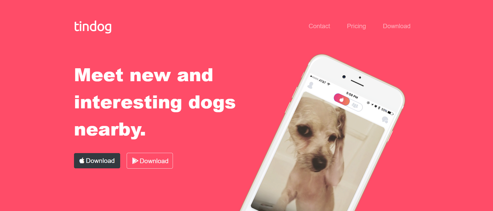

# TinDog 

TinDog is a frontend project that replicates the functionality of the popular dating app Tinder but for dogs. It is built using HTML, CSS, and Bootstrap. The project allows dog owners to connect with each other, find playdates for their furry friends, and explore various dog-related services and products.
# Getting Started
To get a local copy of the project up and running, follow these steps.
## Prerequisites
Make sure you have the following installed:
* Web browser
# Installation
To run this Flipkart clone website locally, follow these steps:

Clone the repository:
git clone https://github.com/YourUsername/TinDog.git

Navigate to the project directory: cd TinDog

Open the index.html file in your preferred web browser.

# Screenshot

# Disclaimer
This project is a clone of the Tinder website created for learning purposes. It is not affiliated with or endorsed by Tinder in any way.

Please note that this project is not intended for production use and may lack certain security features and optimizations found in the original Tinder website.
